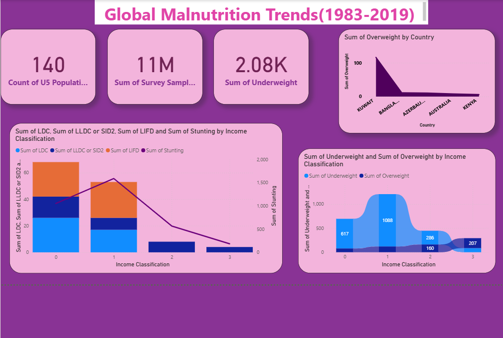
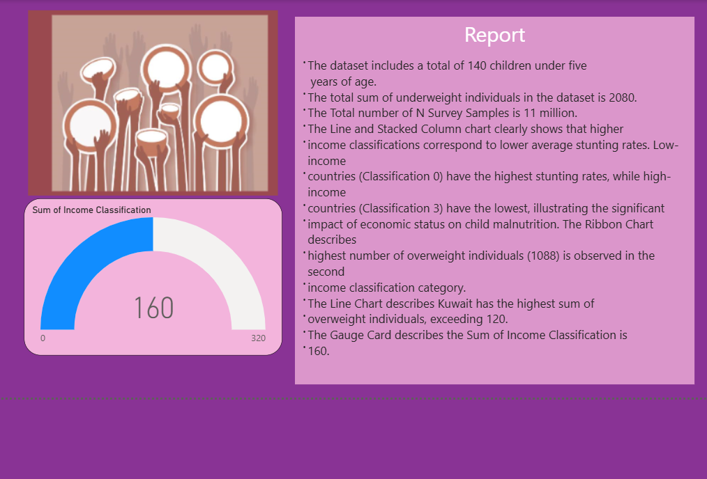

# 📊 Global Malnutrition Trends: Power BI Analysis (1983–2019)

## 📌 Introduction

ABC Company is undertaking an in-depth analysis of global malnutrition trends from 1983 to 2019 to better understand the prevalence and distribution of various forms of malnutrition among children under five years of age. Utilizing a comprehensive dataset from UNICEF, WHO, and the World Bank, the project focuses on key malnutrition indicators: **severe wasting**, **wasting**, **stunting**, **underweight**, and **overweight**.

The analysis segments countries by **income classifications**—low, lower-middle, upper-middle, and high income—as well as categories such as **Least Developed Countries (LDC)**, **Low Income Food Deficient (LIFD)**, **Land Locked Developing Countries (LLDC)**, and **Small Island Developing States (SIDS)**. Power BI visualizations, including **stacked bar charts**, **line charts**, and **ribbon charts**, are used to uncover critical trends and regional disparities.

Malnutrition remains a significant global health issue, with disproportionate impacts on children in lower-income regions. This project aims to identify correlations between economic status and malnutrition rates and highlight areas in need of urgent intervention.

---

## 📊 Project Overview

This Power BI analysis provides actionable insights into global child malnutrition patterns over 36 years. Key objectives include:

- Identifying correlations between income classifications and malnutrition types.
- Highlighting trends in underweight and overweight conditions.
- Evaluating country-level disparities and the effect of economic status on nutrition outcomes.
- Supporting data-driven decision-making for policy development and resource allocation.

Visuals reflect a combination of statistical depth and accessibility for decision-makers, with data sourced from global health organizations and robust sample sizes (e.g., 11 million survey records).

---

## 🖼️Visualizations

### Dashboard Page


### Report Page


---

## 🚀 Getting Started

To explore or understand the project:

1. **View the project documentation:**
   📄 [View Global Malnutrition Project Document](./doc-global%20malnutrition%20project%20doc.docx)  
   *(Provides detailed context, objectives, and methodology.)*

2. **Watch the demo video:**
   📽️ [Watch Power BI Walkthrough Video on Google Drive](https://drive.google.com/file/d/1CtPrA01XAYpMwK-njdsr3rwvvrVzSaAQ/view?usp=sharing)  
   *(Includes a screen recording showcasing dashboard interactions and key insights.)*

3. **Clone the repository:**
   ```bash
   git clone https://github.com/parvanii/Global-Malnutrition-Trends-1983-2019-.git

